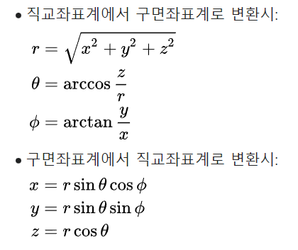

# Opencv

<br>

## 시작하기

<br>

### visual studio에서 opencv를 사용하기 위해선 다음과 같이 설정해야 한다

> 참고) https://webnautes.tistory.com/1132


### 이미지 불러오기

``` cpp
imread("filename", flag)
```

* filename: 불러올 이미지의 경로
* flag: 옵션
    > 1. `1`, `IMREAD_COLOR`: 이미지 파일을 색 정보(Color)를 포함해서 불러온다, default
    > 2. `0`, `IMREAD_GRAYSCALE`: 이미지 파일을 흑백(Grayscale)으로 변환해서 불러온다
    > 3. `-1`, `IMREAD_UNCHANGED`: 이미지 파일을 색정보에 알파채널(Alpah channel)까지 포함해서 불러온다.

<br>

### Mat Class
> Matirx의 약자로 행렬을 표현하기 위한 데이터

* C++ 스타일의 N차원 고밀도 배열 클래스이며 행렬(2차원)을 비롯해 배열(1, 2, 3차원)을 효율적으로 표현할 수 있다

Mat 클래스는 헤더(Header)와 데이터 포인터(Data Pointer)로 구성되어 있다
> * 헤더: 에는 Mat 클래스에 대한 정보(행렬의 크기, 깊이 등)가 저장
> * 데이터 포인터: 각 데이터가 담겨있는 메모리 주소 정보가 저장

<br>

### 이미지 보여주기


``` cpp
imshow("windowName", image)
```

* windowName: 이미지를 보여줄 윈도우 창의 이름
* image: 보여주고자 하는 <Mat> 형식의 변수 이름

<br>

``` cpp
waitKey(delay time);
```

* delay time: 키 입력을 기다릴 시간
    > 0을 입력하면 무한 대기

imshow() 함수를 사용하게 되면 waitKey() 함수가 필수적으로 따라와야 한다.
 * waitKey() 함수를 사용하지 않으면 이미지가 노출되자마자 코드가 종료됨

<br>

### 직교 좌표를 구 좌표로 변환

<br>



<br>

``` cpp
radius = sqrt(x*x + y*y + z*z)
theta = atan2(y, x)
phi = acos(z / radius) // or phi = atan2(y, x)
```

<br>


``` cpp
#include <opencv2/core.hpp>
#include <opencv2/highgui.hpp>
#include <iostream>
#include <stdio.h>
#include<math.h>

using namespace cv;
using namespace std;

#define PI    3.141592653589793

typedef struct {
    float pos[3]; // 0: x, 1: y, 2: z 좌표
}Pos;

float* GetCubemapCoordinate(float* p, int x, int y, int face, int edge);
Mat SphToCubemap(Mat *sph, float * p);


int main(int, char**)
{
    Mat img = imread("C:\\Users\\admin\\Desktop\\git\\ECL\\contents\\Images\\Opencv\\spherical.jpg", 1);

    Pos p;

    Mat cubemap = SphToCubemap(&img, p.pos);

    imshow("dfae", cubemap);
    waitKey(0);

    return 0;
}


float* GetCubemapCoordinate(float* p, int x, int y, int face, int edge)
{
    float a = 2.0 * float(x / edge);
    float b = 2.0 * float(y / edge);

    p[0] = 0;      // x 좌표 초기화
    p[1] = 0;      // y 좌표 초기화
    p[2] = 0;      // z 좌표 초기화

    if (face == 0)    // back
    {
        p[0] = -1.0;
        p[1] = 1.0 - a;
        p[2] = 3.0 - b;
    }
    else if (face == 1) // left
    {
        p[0] = a - 3.0;
        p[1] = -1.0;
        p[2] = 3.0 - b;
    }
    else if (face == 2) // front
    {
        p[0] = 1.0;
        p[1] = a - 5.0;
        p[2] = 3.0 - b;
    }
    else if (face == 3) // right
    {
        p[0] = 7.0 - a;
        p[1] = 1.0;
        p[2] = 3.0 - b;
    }
    else if (face == 4) // top
    {
        p[0] = b - 1.0;
        p[1] = a - 5.0;
        p[2] = 1.0;
    }
    else if (face == 5) // bottom
    {
        p[0] = 5.0 - b;
        p[1] = a - 5.0;
        p[2] = -1.0;
    }
    return p;
}

Mat SphToCubemap(Mat *sph, float* p)
{
    Mat cube;
    int width = sph->size().width;
    int height = 0.75 * sph->size().width;
    int edge = sph->size().width / 4;
    int startidx, range;

    cube = Mat::zeros(height, width, sph->type());

    float theta, phi;
    float u, v;

    for (int i = 0; i < width; i++)
    {
        int face = i / edge;

        if (face == 1)  // left
        {
            startidx = 0;
            range = 3 * edge;
        }
        else
        {
            startidx = edge;
            range = 2 * edge;
        }
        for (int j = startidx; j < range; j++)
        {
            if (j < edge)
                face = 4;  // top
            else if (j >= 2 * edge)
                face = 5;  // bottom
            p = GetCubemapCoordinate(p, i, j, face, edge);
            theta = atan2(p[1], p[0]);
            phi = atan2(p[2], sqrt((p[0] * p[0]) + (p[1] * p[1])));
            u = 2 * edge * ((theta + PI) / PI);
            v = 2 * edge * (((PI / 2) - phi) / PI);

            cube.at<Vec3f>(j, i) = sph->at<Vec3f>(v, u);
            
        }

    }
    return cube;
}

```


ref) 
* https://stackoverflow.com/questions/34250742/converting-a-cubemap-into-equirectangular-panorama
* http://paulbourke.net/panorama/cubemaps/
* https://stackoverflow.com/questions/29678510/convert-21-equirectangular-panorama-to-cube-map
* https://github.com/trotlinebeercan/360-pano-to-cubemap/blob/master/PanoToCube.h